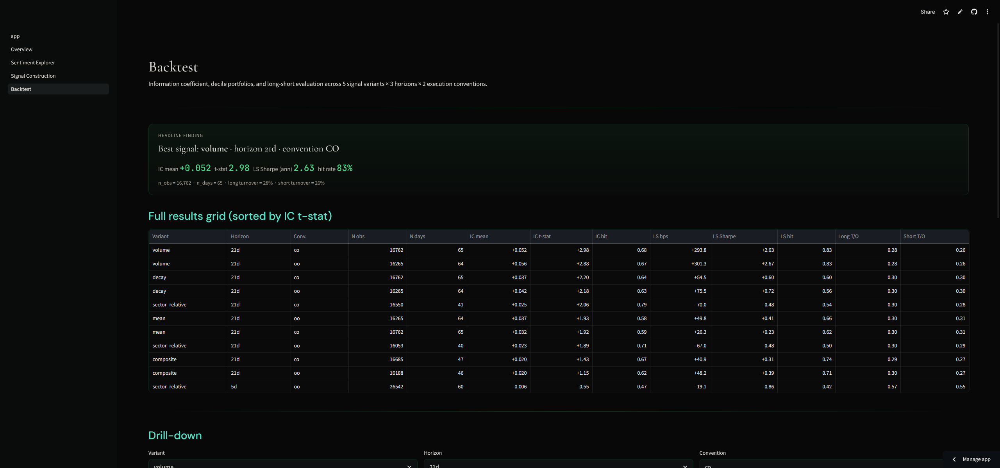
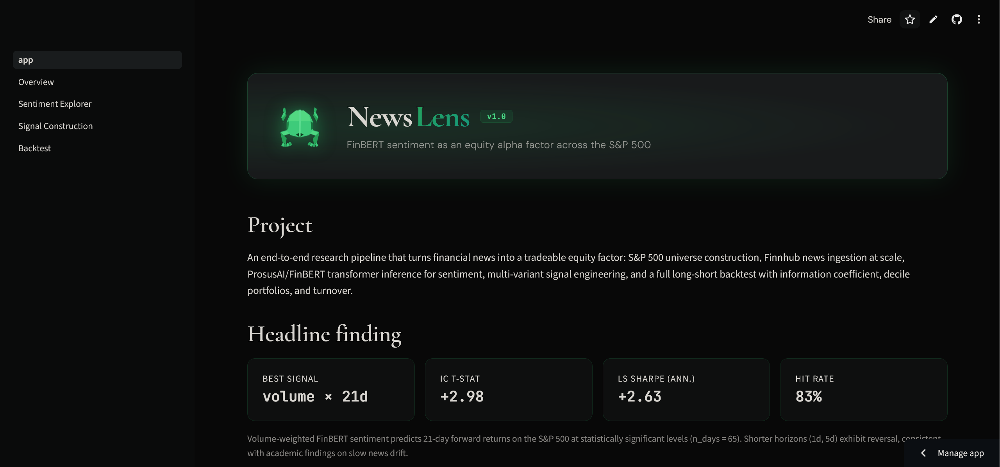
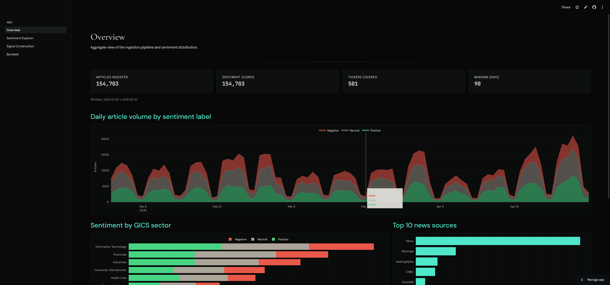
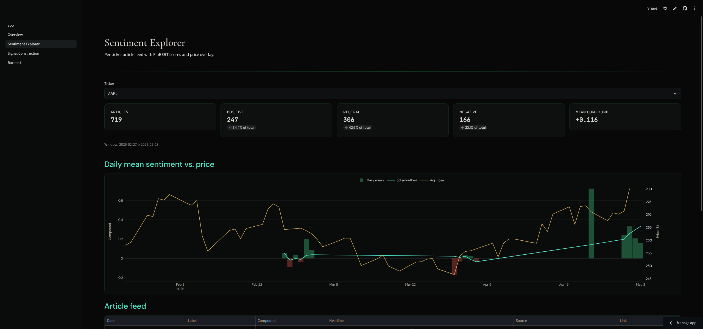
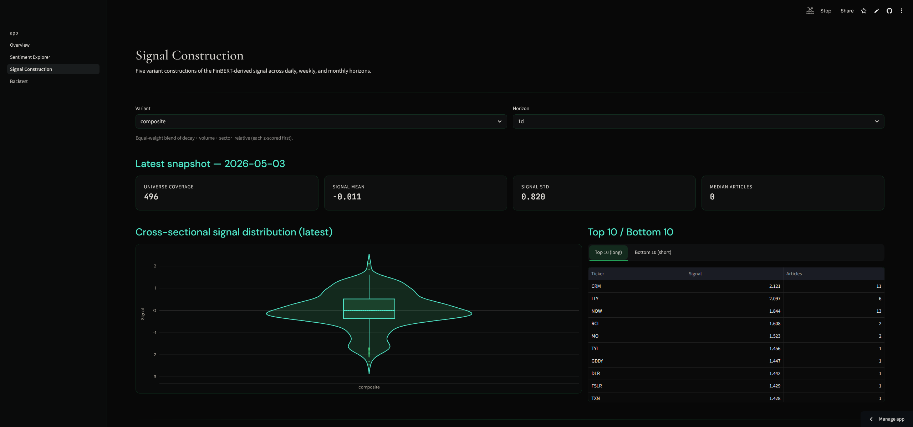

# NewsLens

FinBERT sentiment as an equity alpha factor across the S&P 500.

**Live demo:** https://newslens-marinx.streamlit.app

**Repo:** https://github.com/Marin-X/NewsLens



---

## Headline finding

Across a 90-day window of S&P 500 company news (~155k articles, scored with `ProsusAI/finbert`), the volume-weighted sentiment signal at a 21-day forward horizon produced:

- **IC mean** = +0.052
- **IC t-stat** = 2.98 (significant at 95% confidence)
- **Long-short Sharpe (annualized)** = 2.63 (pre-cost)
- **LS hit rate** = 83% over 65 daily portfolios

Shorter horizons (1d, 5d) showed *negative* IC at high turnover, consistent with the academic finding that news sentiment information takes weeks to fully reflect in prices.

## Pipeline

1. **Universe** — S&P 500 from Wikipedia (cached weekly to parquet).
2. **News ingestion** — Finnhub `company-news` endpoint, monthly chunks, SQLite with FK + dedup.
3. **Sentiment** — `ProsusAI/finbert` batch inference on CPU. ~155k articles in ~2 hours.
4. **Signal construction** — 5 variants (mean, intraday-decay, volume-scaled, sector-relative, composite); 3 horizons (1d, 5d, 21d); cross-sectional z-score + decay-weighted carry-forward across silent days.
5. **Forward returns** — yfinance OHLCV; close-to-close and open-to-open conventions; 1d/5d/21d horizons.
6. **Backtest** — Daily Spearman IC, decile portfolios, long-short P&L, leg turnover; 30 (variant × horizon × convention) combinations evaluated in one run.
7. **Dashboard** — Streamlit, 4 pages, charcoal/emerald design system.

## Stack

Python · pandas · numpy · scipy · plotly · streamlit · transformers · torch · finnhub · yfinance · sqlite3 · parquet

## Dashboard

The Streamlit app exposes four pages, each rendered from cached parquet outputs of the pipeline.

### Home



### Overview

Pipeline summary, ingestion volume, and aggregate sentiment distribution by sector and source.



### Sentiment Explorer

Per-ticker article feed with FinBERT scores and price overlay.



### Signal Construction

Five variant constructions of the FinBERT-derived signal across daily, weekly, and monthly horizons; cross-sectional distribution and persistence (autocorrelation) per variant.



### Backtest

Information coefficient, decile portfolios, and long-short evaluation across 5 signal variants × 3 horizons × 2 execution conventions (close-to-close, open-to-open).


## Local run

```bash
git clone https://github.com/Marin-X/NewsLens.git
cd NewsLens
python -m venv .venv
.venv\Scripts\Activate.ps1
pip install -r requirements.txt

cp .env.example .env
# Add your Finnhub API key to .env

python src/universe.py
python src/ingest.py
python src/sentiment.py
python src/signals.py
python src/prices.py
python src/returns.py
python src/backtest.py

streamlit run app.py
```

## Repo layout

```
NewsLens/
├── app.py                  # Streamlit entry
├── pages/                  # 4 dashboard pages
├── src/
│   ├── universe.py         # S&P 500 loader
│   ├── ingest.py           # Finnhub news puller
│   ├── sentiment.py        # FinBERT scoring
│   ├── signals.py          # 5 signal variants
│   ├── prices.py           # yfinance OHLCV
│   ├── returns.py          # forward returns
│   ├── backtest.py         # IC / decile / LS
│   └── db.py               # SQLite schema
├── data/                   # cached parquet + sqlite (gitignored)
├── screenshots/            # dashboard screenshots for README
├── dashboard.png           # hero image for portfolio card
├── requirements.txt
└── README.md
```

## Caveats

- **Sample size:** 65 daily observations at the 21d horizon is enough for IC significance but is not a regime-robust validation. Longer history would strengthen claims.
- **Pre-cost:** Backtest does not model commissions, market impact, or borrow costs. Daily-rebalanced versions (1d, 5d) would be uneconomic at observed turnover (~88% long, ~88% short).
- **Survivorship bias:** Universe is current S&P 500 constituents, not point-in-time membership.
- **Single source:** News only. Reddit, SEC filings, and earnings transcripts are roadmap items.

## Author

Marin Xhemollari · [marinxhemollari.com](https://marinxhemollari.com) · [github.com/Marin-X](https://github.com/Marin-X)